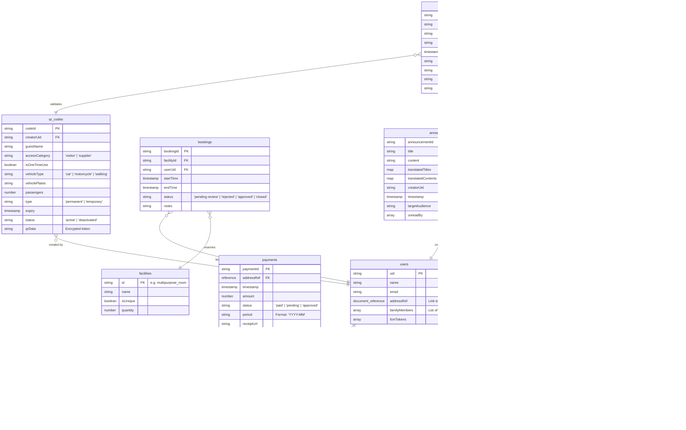

# Firestore Database Schema

The following structure is optimized for a residential management application using Flutter and Firebase.

## Entity Relationship Diagram (ERD)

## Collections

### `users` (Collection)
- `uid`: string (Document ID)
- `name`: string
- `email`: string
- `addressRef`: document_reference (to `addresses` collection)
- `familyMembers`: array of uids (for residents)
- `fcmTokens`: array of strings (for push notifications)

### `addresses` (Collection)
- `addressId`: string (Document ID, e.g., 'A-101')
- `residentUid`: string (UID of primary resident, null if unclaimed)
- `streetName`: string (Exact name of street)
- `number`: number (Physical house number)
- `paymentStatus`: string ('paid', 'pending', 'reviewing', 'restricted')
    - `paid`: All OK
    - `pending`: Required payment within grace period
    - `reviewing`: Proof of payment is being reviewed by an admin
    - `restricted`: Account restricted for missing payment after grace period
- `deliveryDate`: timestamp (Date the property was handed over to the resident)
- `lastPaymentApproval`: timestamp

### `qr_codes` (Collection)
- `codeId`: string (Document ID)
- `creatorUid`: string
- `guestName`: string
- `accessCategory`: string ('visitor', 'supplier')
- `isOneTimeUse`: boolean
- `vehicleType`: string ('car', 'motorcycle', 'walking')
- `vehiclePlates`: string (Optional, for vehicles)
- `passengers`: number (Optional, for vehicles)
- `type`: string ('permanent', 'temporary')
- `expiry`: timestamp (for temporary)
- `status`: string ("active", "deactivated (validated|revoked|expired)")
- `qrData`: string (encrypted or unique token)

### `bookings` (Collection)
- `bookingId`: string (Document ID)
- `facilityId`: string ('multipurpose_room', 'bicycle_1', etc.)
- `userUid`: string
- `startTime`: timestamp
- `endTime`: timestamp
- `status`: string ("pending review", "rejected", "approved (upcoming)", "approved (in use)", "closed")
- `notes`: string

### `announcements` (Collection)
- `announcementId`: string (Document ID)
- `title`: string (Original)
- `content`: string (Original)
- `translatedTitles`: map (e.g., `{ "en": "...", "es": "..." }`) - Populated by Gemini Cloud Function
- `translatedContents`: map (e.g., `{ "en": "...", "es": "..." }`) - Populated by Gemini Cloud Function
- `creatorUid`: string
- `timestamp`: timestamp
- `targetAudience`: string ('all', 'residents', 'specific_uid')
- `unreadBy`: array of uids (or subcollection for tracking)

### `documents` (Collection)
- `docId`: string (Document ID)
- `title`: string
- `url`: string (Firebase Storage URL)
- `category`: string ('normative', 'contract', 'government')
- `uploadedAt`: timestamp

### `access_logs` (Collection)
- `logId`: string (Document ID)
- `qrCodeId`: string
- `guardUid`: string
- `creatorUid`: string
- `timestamp`: timestamp
- `visitorIdPhotoUrl`: string
- `visitorPlatePhotoUrl`: string (Optional)
- `status`: string ('allowed', 'denied')
- `reason`: string

### `payments` (Collection)
- `paymentId`: string (Document ID)
- `addressRef`: document_reference (to `addresses` collection)
- `timestamp`: timestamp
- `amount`: number
- `status`: string ('paid', 'pending', 'approved')
- `period`: string (Format: 'YYYY-MM', e.g., '2026-05')
- `receiptUrl`: string (Optional)

### `ownership_claims` (Collection)
- `claimId`: string (Document ID)
- `userUid`: string (UID of claimant)
- `addressRef`: document_reference (to `addresses` collection)
- `proofUrl`: string (Firebase Storage URL of uploaded deed/receipt)
- `deliveryDate`: timestamp (Target delivery date selected by the resident)
- `status`: string ('pending', 'approved', 'rejected')
- `timestamp`: timestamp

### `facilities` (Collection)
- `id`: string (Document ID, unique facility code e.g., 'multipurpose_room')
- `name`: string (Localized or descriptive display label)
- `isUnique`: boolean (True if single capacity unique amenity, False for multi-item amenities)
- `quantity`: number (Available inventorial capacity, locked to 1 if isUnique is true)

### `config` (Collection)
#### `app_settings` (Document)
- `paymentCutoffDay`: number (Configured day of the month serving as cutoff date, default 1)
- `gracePeriodDays`: number (Grace period span before user features restrict automatically, default 10)
- `updatedAt`: timestamp

#### `smtp_settings` (Document - Admin Only)
- `enabled`: boolean (Flag enabling automatic welcome email dispatch upon user creation/import)
- `host`: string (SMTP server host e.g. `smtp.gmail.com`)
- `port`: number (SMTP server port e.g. `587`, `465`, `25`)
- `secure`: boolean (True for port 465 SSL, false for 587 STARTTLS)
- `user`: string (SMTP authentication username / email)
- `pass`: string (SMTP authentication password / App Password / API Key)
- `senderEmail`: string (Optional override sender email address)
- `senderName`: string (Optional override sender display label e.g. "Suburban Life Administration")
- `customSubject`: string (Optional customized welcome email subject with placeholders like %appName%)
- `customBody`: string (Optional customized multiline message body supporting %name%, %email%, %password%, %address%, %role%, %appName%)
- `updatedAt`: timestamp

## Firestore Composite Indexes

The application requires specific composite indexes to execute queries without database errors. Ensure the following indexes are generated in Firebase:

### `bookings` Collection
- **Index 1**:
  - `facilityId` (Ascending)
  - `startTime` (Ascending)

### `payments` Collection
- **Index 1**:
  - `addressRef` (Ascending)
  - `period` (Descending)

### `ownership_claims` Collection
- **Index 1**:
  - `status` (Ascending)
  - `timestamp` (Descending)
