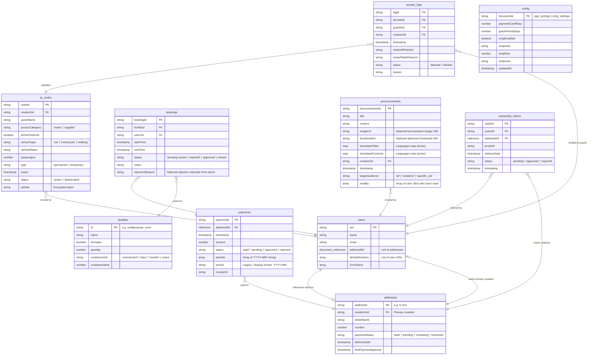

# Firestore Database Schema

The following structure is optimized for a residential management application using Flutter and Firebase.

## Entity Relationship Diagram (ERD)

```mermaid
erDiagram
    users {
        string uid PK
        string name
        string email
        document_reference addressRef "Link to addresses"
        array familyMembers "List of user UIDs"
        array fcmTokens
    }
    addresses {
        string addressId PK "e.g. A-101"
        string residentUid FK "Primary resident"
        string streetName
        number number
        string paymentStatus "'paid' | 'pending' | 'reviewing' | 'restricted'"
        timestamp deliveryDate
        timestamp lastPaymentApproval
    }
    qr_codes {
        string codeId PK
        string creatorUid FK
        string guestName
        string accessCategory "'visitor' | 'supplier'"
        boolean isOneTimeUse
        string vehicleType "'car' | 'motorcycle' | 'walking'"
        string vehiclePlates
        number passengers
        string type "'permanent' | 'temporary'"
        timestamp expiry
        string status "'active' | 'deactivated'"
        string qrData "Encrypted token"
    }
    bookings {
        string bookingId PK
        string facilityId FK
        string userUid FK
        timestamp startTime
        timestamp endTime
        string status "'pending review' | 'rejected' | 'approved' | 'closed'"
        string notes
        string rejectionReason "Optional rejection rationale from admin"
    }
    announcements {
        string announcementId PK
        string title
        string content
        string imageUrl "Optional full-resolution image URL"
        string thumbnailUrl "Optional optimized thumbnail URL"
        map translatedTitles "Languages map (en/es)"
        map translatedContents "Languages map (en/es)"
        string creatorUid FK
        timestamp timestamp
        string targetAudience "'all' | 'residents' | 'specific_uid'"
        array readBy "Array of user UIDs who have read"
    }
    access_logs {
        string logId PK
        string qrCodeId FK
        string guardUid FK
        string creatorUid FK
        timestamp timestamp
        string visitorIdPhotoUrl
        string visitorPlatePhotoUrl
        string status "'allowed' | 'denied'"
        string reason
    }
    payments {
        string paymentId PK
        reference addressRef FK
        timestamp timestamp
        number amount
        string status "'paid' | 'pending' | 'approved' | 'rejected'"
        array periods "Array of 'YYYY-MM' strings"
        string period "Legacy / display format: 'YYYY-MM'"
        string receiptUrl
    }
    ownership_claims {
        string claimId PK
        string userUid FK
        reference addressRef FK
        string proofUrl
        timestamp deliveryDate
        string status "'pending' | 'approved' | 'rejected'"
        timestamp timestamp
    }
    facilities {
        string id PK "e.g. multipurpose_room"
        string name
        boolean isUnique
        number quantity
        string cooldownUnit "'unrestricted' | 'days' | 'months' | 'years'"
        number cooldownValue
    }
    config {
        string documentId PK "app_settings | smtp_settings"
        number paymentCutoffDay
        number gracePeriodDays
        boolean smtpEnabled
        string smtpHost
        number smtpPort
        string smtpUser
        timestamp updatedAt
    }

    users ||--o| addresses : "references address"
    addresses ||--o| users : "claims primary resident"
    qr_codes }o--|| users : "created by"
    bookings }o--|| users : "booked by"
    bookings }o--|| facilities : "reserves"
    announcements }o--|| users : "created by"
    access_logs }o--|| qr_codes : "validates"
    access_logs }o--|| users : "verified by guard"
    payments }o--|| addresses : "paid for"
    ownership_claims }o--|| users : "claimed by"
    ownership_claims }o--|| addresses : "claims address"
```

## Collections

### `users` (Collection)
- `uid`: string (Document ID)
- `name`: string
- `email`: string
- `addressRef`: document_reference (to `addresses` collection)
- `familyMembers`: array of uids (for residents)
- `fcmTokens`: array of strings (for push notifications)

### `addresses` (Collection)
- `addressId`: string (Document ID, e.g., 'A-101' or fixed 'admin_office')
- `residentUid`: string (UID of primary resident, null if unclaimed)
- `streetName`: string (Exact name of street, e.g. 'Admin office' for administration)
- `number`: number (Physical house number, 0 for Admin office)
- `paymentStatus`: string ('paid', 'pending', 'restricted', 'reviewing')
    - `paid`: All OK / all periods approved
    - `pending`: Required payment due or proof of payment submitted pending admin approval. When `isWithinGracePeriod` is true, resident is considered 'paid' and has unrestricted access.
    - `restricted`: Account restricted for missing payment after grace period expired or overdue historical debt
    - `reviewing`: Legacy synonym for 'pending'
- `isWithinGracePeriod`: boolean (Indicates whether the address is currently within the active payment grace period with no overdue past debt)
- `hasActiveSanctions`: boolean (True if the address has at least one active unpaid sanction, restricting access)
- `activeSanctionsCount`: number (Count of currently active unpaid sanctions)
- `deliveryDate`: timestamp (Date the property was handed over to the resident)
- `lastPaymentApproval`: timestamp

### `qr_codes` (Collection)
- `codeId`: string (Document ID)
- `creatorUid`: string
- `guestName`: string
- `accessCategory`: string ('visitor', 'supplier')
- `isOneTimeUse`: boolean
- `vehicleType`: string ('car', 'motorcycle', 'walking')
- `vehiclePlates`: string (Optional, for vehicles)
- `passengers`: number (Optional, for vehicles)
- `type`: string ('permanent', 'temporary')
- `expiry`: timestamp (for temporary)
- `status`: string ("active", "deactivated (validated|revoked|expired)")
- `qrData`: string (encrypted or unique token)

### `bookings` (Collection)
- `bookingId`: string (Document ID)
- `facilityId`: string ('multipurpose_room', 'bicycle_1', etc.)
- `userUid`: string
- `startTime`: timestamp
- `endTime`: timestamp
- `status`: string ("pending review", "rejected", "approved (upcoming)", "approved (in use)", "closed")
- `isConfirmed`: boolean (True for approved/closed bookings; allows public calendar availability query)
- `notes`: string
- `rejectionReason`: string (Optional rationale provided by administrator upon rejection)
- `approvalMessage`: string (Custom instructions/next steps provided by administrator or populated from facility preset)

### `announcements` (Collection)
- `announcementId`: string (Document ID)
- `title`: string (Original)
- `content`: string (Original)
- `imageUrl`: string (Optional Firebase Storage URL of full-resolution image)
- `thumbnailUrl`: string (Optional Firebase Storage URL of proportional thumbnail)
- `translatedTitles`: map (e.g., `{ "en": "...", "es": "..." }`) - Populated by Gemini Cloud Function
- `translatedContents`: map (e.g., `{ "en": "...", "es": "..." }`) - Populated by Gemini Cloud Function
- `creatorUid`: string
- `timestamp`: timestamp
- `targetAudience`: string ('all', 'residents', 'specific_uid')
- `readBy`: array of user UIDs who have read the announcement

### `document_categories` (Collection)
- `catId`: string (Document ID / slug, e.g. 'normatives', 'contracts')
- `name`: string (Category display label)
- `createdAt`: timestamp
- `updatedAt`: timestamp (Optional)

### `document_folders` (Collection)
- `folderId`: string (Document ID)
- `name`: string (Folder display name)
- `parentId`: string (Parent folder ID or 'root' for root directory)
- `createdAt`: timestamp
- `createdBy`: string (Admin UID)

### `documents` (Collection)
- `docId`: string (Document ID)
- `title`: string (Display title)
- `fileName`: string (Original file name with extension, e.g. "Presupuesto_2026.pdf")
- `fileType`: string (Lowercase file extension: 'pdf', 'md', 'txt', 'docx', 'xlsx', 'png', etc.)
- `fileSize`: number (File size in bytes)
- `url`: string (Firebase Storage URL)
- `storagePath`: string (Cloud Storage object path)
- `category`: string ('normatives', 'contracts', 'financial', 'communiques', etc.)
- `publicationDate`: timestamp (Official publication/issue date of document)
- `uploadedAt`: timestamp (Creation timestamp)
- `folderId`: string (Folder ID or 'root' for root directory)
- `uploaderUid`: string (Admin UID)

### `access_logs` (Collection)
- `logId`: string (Document ID)
- `qrCodeId`: string
- `guardUid`: string
- `creatorUid`: string
- `timestamp`: timestamp
- `visitorIdPhotoUrl`: string
- `visitorPlatePhotoUrl`: string (Optional)
- `status`: string ('allowed', 'denied')
- `reason`: string

### `payments` (Collection)
- `paymentId`: string (Document ID)
- `addressRef`: document_reference (to `addresses` collection)
- `residentUid`: string (UID of resident associated with the payment)
- `uploaderUid`: string (UID of user/admin who uploaded receipt)
- `timestamp`: timestamp (or integer milliseconds)
- `amount`: number (Monetary amount captured from transfer receipt)
- `status`: string ('paid' | 'pending' | 'approved' | 'rejected')
- `folio`: string (Receipt tracking/folio number reported by resident)
- `concept`: string ('monthly quota' | 'sanction')
- `paymentDate`: timestamp (Date the bank transfer / transaction took place)
- `sanctionId`: string (Optional ID of linked sanction when paying a sanction)
- `rejectionReason`: string (Rationale provided by administrator upon rejection)
- `periods`: array of string (List of periods covered by the receipt e.g. `['2026-09', '2026-10']`)
- `period`: string (Format: 'YYYY-MM' or comma-joined periods for backward compatibility)
- `receiptUrl`: string (Optional)

### `sanctions` (Collection)
- `id`: string (Document ID)
- `addressRef`: document_reference (to `addresses` collection)
- `addressId`: string (Address ID, e.g. 'A-101')
- `residentUid`: string (UID of primary resident linked to the address)
- `authorizedUids`: array of string (UIDs of primary resident and linked roommates)
- `streetName`: string (Denormalized address display street)
- `number`: number (Denormalized physical house number)
- `reason`: string (Infraction description)
- `evidenceUrl`: string (Firebase Storage URL of photographic evidence)
- `amount`: number (Monetary fine amount)
- `status`: string ('active' | 'pending_review' | 'paid' | 'cancelled')
- `rejectionReason`: string (Optional rationale if sanction payment proof was rejected)
- `paymentId`: string (Optional ID of linked payment document in `payments`)
- `createdAt`: timestamp (Creation timestamp)
- `createdBy`: string (Admin UID who issued sanction)
- `resolvedAt`: timestamp (Timestamp when paid or cancelled)

### `ownership_claims` (Collection)
- `claimId`: string (Document ID)
- `userUid`: string (UID of claimant)
- `addressRef`: document_reference (to `addresses` collection)
- `proofUrl`: string (Firebase Storage URL of uploaded deed/receipt)
- `deliveryDate`: timestamp (Target delivery date selected by the resident)
- `status`: string ('pending' | 'pending review' | 'approved' | 'rejected')
- `timestamp`: timestamp

### `facilities` (Collection)
- `id`: string (Document ID, unique facility code e.g., 'multipurpose_room')
- `name`: string (Localized or descriptive display label)
- `isUnique`: boolean (True if single capacity unique amenity, False for multi-item amenities)
- `quantity`: number (Available inventorial capacity, locked to 1 if isUnique is true)
- `cooldownUnit`: string ('unrestricted', 'days', 'months', 'years')
- `cooldownValue`: number (Cooldown duration before a resident can book the facility again, 0 if unrestricted)
- `anticipationUnit`: string ('unrestricted', 'hours', 'days', 'weeks')
- `anticipationValue`: number (Minimum advance notice required prior to reservation time)
- `openingTime`: string (Daily opening hour in 24-hour HH:mm format, e.g. '08:00', default '00:00')
- `closingTime`: string (Daily closing hour in 24-hour HH:mm format, e.g. '21:00', default '23:59')
- `presetApprovalMessage`: string (Optional default instructions/next steps for approved bookings)

### `config` (Collection)
#### `app_settings` (Document)
- `paymentCutoffDay`: number (Configured day of the month serving as cutoff date, default 1)
- `gracePeriodDays`: number (Grace period span before user features restrict automatically, default 10)
- `timeZone`: string (Configured IANA timezone for cutoff and grace period calculations, default 'America/Mexico_City')
- `paymentRejectionReasons`: array of string (Customizable pool of rejection reason templates for payment reviews)
- `updatedAt`: timestamp

#### `smtp_settings` (Document - Admin Only)
- `enabled`: boolean (Flag enabling automatic welcome email dispatch upon user creation/import)
- `host`: string (SMTP server host e.g. `smtp.gmail.com`)
- `port`: number (SMTP server port e.g. `587`, `465`, `25`)
- `secure`: boolean (True for port 465 SSL, false for 587 STARTTLS)
- `user`: string (SMTP authentication username / email)
- `pass`: string (SMTP authentication password / App Password / API Key)
- `senderEmail`: string (Optional override sender email address)
- `senderName`: string (Optional override sender display label e.g. "Suburban Life Administration")
- `customSubject`: string (Optional customized welcome email subject with placeholders like %appName%)
- `customBody`: string (Optional customized multiline message body supporting %name%, %email%, %password%, %address%, %role%, %appName%)
- `updatedAt`: timestamp

## Firestore Composite Indexes

The application requires specific composite indexes to execute queries without database errors. Ensure the following indexes are generated in Firebase:

### `bookings` Collection
- **Index 1 (Cooldown & User Facility Check)**:
  - `facilityId` (Ascending)
  - `userUid` (Ascending)
  - `startTime` (Ascending)
- **Index 2 (Cooldown Multi-field Status Validation)**:
  - `facilityId` (Ascending)
  - `userUid` (Ascending)
  - `startTime` (Ascending)
  - `status` (Ascending)
- **Index 3 (Active Facility Clashes Filter)**:
  - `facilityId` (Ascending)
  - `status` (Ascending)
- **Index 4 (Facility Schedule Stream)**:
  - `facilityId` (Ascending)
  - `startTime` (Ascending)
- **Index 5 (User Bookings History)**:
  - `userUid` (Ascending)
  - `startTime` (Descending)
- **Index 6 (User Bookings by Date)**:
  - `userUid` (Ascending)
  - `date` (Descending)
- **Index 7 (User Bookings by Facility and Creation)**:
  - `userUid` (Ascending)
  - `facilityId` (Ascending)
  - `createdAt` (Ascending)
- **Index 8 (Facility Bookings by Status and Start Time)**:
  - `facilityId` (Ascending)
  - `status` (Ascending)
  - `startTime` (Ascending)
- **Index 9 (Facility Bookings by Start Time and Status)**:
  - `facilityId` (Ascending)
  - `startTime` (Ascending)
  - `status` (Ascending)

### `payments` Collection
- **Index 1 (Address Payments by Period)**:
  - `addressRef` (Ascending)
  - `period` (Descending)
- **Index 2 (Resident Payments by Timestamp)**:
  - `residentUid` (Ascending)
  - `timestamp` (Descending)
- **Index 3 (Uploader Payments by Creation)**:
  - `uploaderUid` (Ascending)
  - `createdAt` (Descending)
- **Index 4 (Payment Status Filter by Timestamp)**:
  - `status` (Ascending)
  - `timestamp` (Descending)

### `ownership_claims` Collection
- **Index 1**:
  - `status` (Ascending)
  - `timestamp` (Descending)

### `qr_codes` Collection
- **Index 1 (User QR Codes by Timestamp)**:
  - `creatorUid` (Ascending)
  - `timestamp` (Descending)
- **Index 2 (User QR Codes by Creation)**:
  - `creatorUid` (Ascending)
  - `createdAt` (Descending)
- **Index 3 (Status Filter by Timestamp)**:
  - `status` (Ascending)
  - `timestamp` (Descending)

### `documents` Collection
- **Index 1 (Category by Upload Date)**:
  - `category` (Ascending)
  - `uploadedAt` (Descending)
- **Index 2 (Category by Publication Date)**:
  - `category` (Ascending)
  - `publicationDate` (Descending)
- **Index 3 (Folder by Upload Date)**:
  - `folderId` (Ascending)
  - `uploadedAt` (Descending)
- **Index 4 (Category by Creation Date)**:
  - `category` (Ascending)
  - `createdAt` (Descending)

### `access_logs` Collection
- **Index 1 (Creator Logs by Timestamp)**:
  - `creatorUid` (Ascending)
  - `timestamp` (Descending)
- **Index 2 (Category Logs by Timestamp)**:
  - `accessCategory` (Ascending)
  - `timestamp` (Descending)
- **Index 3 (Status Logs by Timestamp)**:
  - `status` (Ascending)
  - `timestamp` (Descending)
